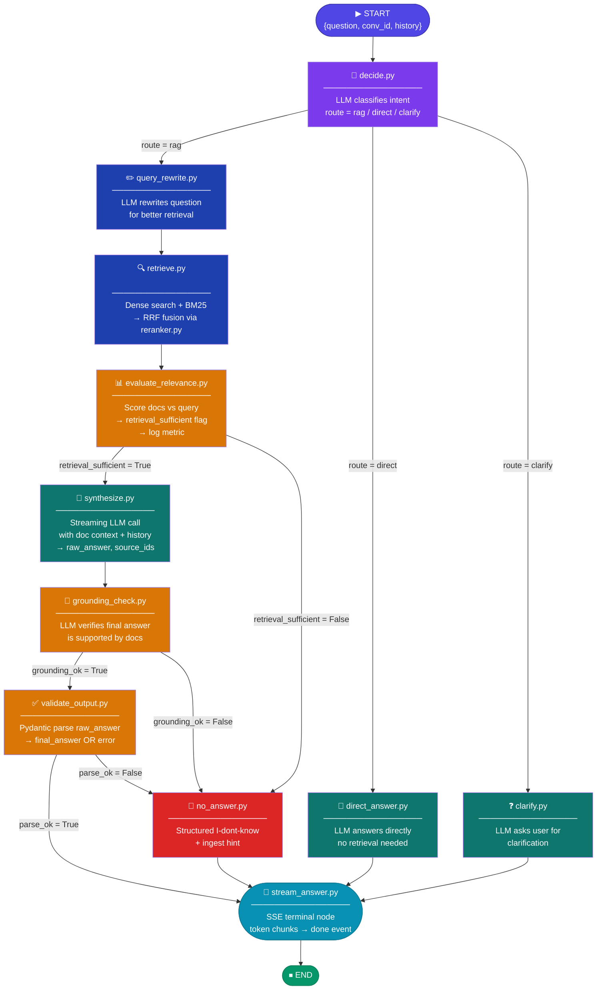
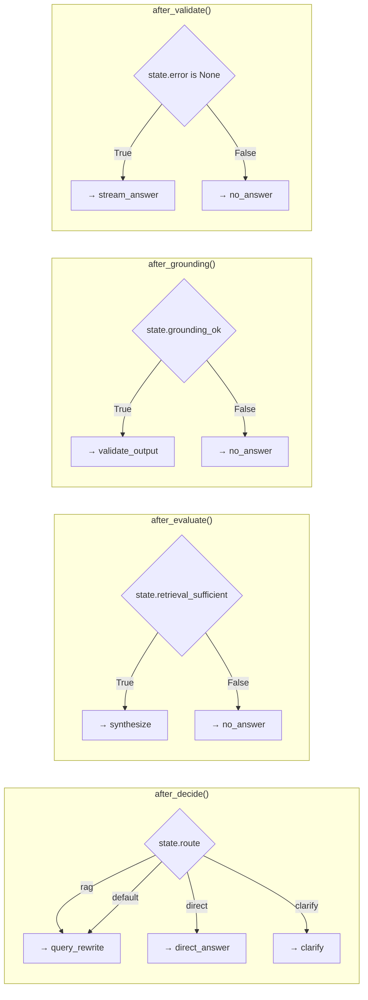

## 📁 Project Folder Structure (Claude Implementation Guide)

```text
agentic_rag/
│
├── app/
│   ├── __init__.py
│   ├── main.py                 # FastAPI / web entrypoint
│   │
│   ├── api/
│   │   ├── __init__.py
│   │   └── v1/
│   │       ├── __init__.py
│   │       ├── router.py       # Mount chat/ingest/health routes
│   │       ├── chat.py         # /chat endpoint (streaming)
│   │       ├── ingest.py       # /ingest endpoint
│   │       ├── health.py       # /health endpoint
│   │       └── models/
│   │           ├── __init__.py
│   │           ├── chat.py     # Request/response schemas
│   │           └── ingest.py
│   │
│   ├── agent/
│   │   ├── __init__.py
│   │   ├── state.py            # AgentState definition
│   │   ├── graph.py            # LangGraph graph wiring
│   │   │
│   │   ├── nodes/
│   │   │   ├── __init__.py
│   │   │   ├── decide.py
│   │   │   ├── query_rewrite.py
│   │   │   ├── retrieve.py
│   │   │   ├── evaluate_relevance.py
│   │   │   ├── grounding_check.py
│   │   │   ├── synthesize.py
│   │   │   ├── validate_output.py
│   │   │   ├── direct_answer.py
│   │   │   ├── clarify.py
│   │   │   ├── no_answer.py
│   │   │   └── stream_answer.py
│   │   │
│   │   ├── tools/
│   │   │   ├── __init__.py
│   │   │   ├── lookup_by_id.py
│   │   │   └── memory_store.py  # Placeholder helpers, can be stubbed
│   │   │
│   │   └── memory/              # 🔴 Leave this folder EMPTY for now
│   │       # Memory integration will be implemented later.
│   │
│   ├── llm/
│   │   ├── __init__.py
│   │   ├── llm_factory.py       # Creates chat/completion clients
│   │   └── providers/
│   │       ├── __init__.py
│   │       └── ollama.py        # Example provider (any LLM backend)
│   │
│   ├── embedding/
│   │   ├── __init__.py
│   │   ├── embedding_factory.py
│   │   └── providers/
│   │       ├── __init__.py
│   │       └── ollama.py
│   │
│   ├── vectorstore/
│   │   ├── __init__.py
│   │   ├── base.py
│   │   ├── chroma.py
│   │   └── reranker.py
│   │
│   ├── ingest/
│   │   ├── __init__.py
│   │   ├── document_processor.py
│   │   └── utils/
│   │       ├── __init__.py
│   │       ├── load_document.py
│   │       ├── clean.py
│   │       ├── chunk_with_metadata.py
│   │       └── batch.py
│   │
│   └── core/
│       ├── __init__.py
│       ├── config.py
│       ├── logging.py
│       ├── metrics.py
│       ├── circuit_breaker.py
│       ├── security.py
│       ├── exceptions.py
│       └── schemas.py
│
├── tests/
│   ├── __init__.py
│   ├── conftest.py
│   ├── agent/
│   │   ├── __init__.py
│   │   ├── conftest.py
│   │   ├── test_graph.py
│   │   ├── test_nodes.py
│   │   └── test_tools.py
│   ├── api/
│   │   ├── __init__.py
│   │   ├── conftest.py
│   │   ├── test_chat.py
│   │   └── test_ingest.py
│   ├── ingest/
│   │   ├── __init__.py
│   │   └── test_document_processor.py
│   ├── vectorstore/
│   │   ├── __init__.py
│   │   ├── conftest.py
│   │   └── test_chroma_adapter.py
│   ├── llm/
│   │   ├── __init__.py
│   │   └── test_llm_factory.py
│   ├── embedding/
│   │   ├── __init__.py
│   │   └── test_embedding_factory.py
│   ├── test_circuit_breaker.py
│   └── test_security.py
│
├── Dockerfile
├── docker-compose.yml
├── docker-compose.test.yml
├── .env.example
├── pyproject.toml
├── Makefile
├── .pre-commit-config.yaml
├── .github/
│   └── workflows/
│       └── ci.yml
└── README.md
```

> **Memory note for Claude agents:** Do not implement any actual long-term memory logic yet. The `app/agent/memory/` package must remain empty (no Python modules) until a later phase. You can still pass conversation history in `AgentState.history`.

---

## 🤖 Agent Graph — Updated Flow (Grounding After Synthesis)

This version avoids the "grounding before answer" issue. The flow is:

- **Retrieve → Evaluate → Synthesize → GroundingCheck → Validate → Stream**
- Grounding is performed **on the drafted answer**, comparing its claims against retrieved documents.



---

## 🔀 Conditional Edge Router Functions (Updated)



---

## 📦 AgentState — Shared Data Contract (Reference)

Claude agents should maintain a single `AgentState` object flowing through the graph. Suggested fields:

```text
class AgentState:
    question: str
    conversation_id: str
    request_id: str
    history: list          # previous turns

    rewritten_query: str
    retrieved_docs: list
    retrieval_score: float
    retrieval_sufficient: bool

    raw_answer: str
    final_answer: str
    source_ids: list

    grounding_ok: bool
    metadata: dict
    error: str | None
    route: str | None      # "rag" | "direct" | "clarify"
```

> **Memory constraint:** do not add long-term memory fields yet (no separate memory store). Only use short-term `history` and retrieved docs.

---

## 🛠️ Step‑by‑Step Implementation Plan (for Claude Agents)

This section is written so an autonomous Claude agent can implement the project reliably.

### 1. Repository & Environment

- **1.1 Create project layout**
  - Ensure the top‑level folder structure matches the tree above.
  - Create empty `__init__.py` files wherever needed so packages import cleanly.
- **1.2 Dependency management**
  - Create `pyproject.toml` (or `requirements.txt`) with:
    - FastAPI, Uvicorn
    - LangGraph / LangChain (or similar graph library)
    - Chroma (or another vector store)
    - Pydantic
    - HTTP client for LLM provider (e.g. `httpx`)
- **1.3 Configuration**
  - Implement `core/config.py` to load env vars for:
    - LLM provider/base URL/model name
    - Embedding model name
    - Vector DB URL / path
    - Feature flags (e.g. `ENABLE_MEMORY=false` for now).

### 2. Core Infrastructure

- **2.1 Logging & metrics**
  - In `core/logging.py`, configure structured logging (JSON or key/value).
  - In `core/metrics.py`, expose simple counters/timers (can be in‑memory).
- **2.2 Security & exceptions**
  - Implement `core/security.py` for basic API key or token check.
  - Implement `core/exceptions.py` with custom exception types and handlers.
- **2.3 Schemas**
  - In `core/schemas.py`, define shared Pydantic models (e.g. `Document`, `Chunk`, `Source`).

### 3. LLM & Embeddings

- **3.1 LLM factory**
  - Implement `llm/llm_factory.py` with a `get_chat_llm()` function:
    - Reads config.
    - Returns a client capable of streaming responses.
- **3.2 Providers**
  - Implement `llm/providers/ollama.py` (or the chosen backend) with:
    - Thin wrapper around the HTTP API.
- **3.3 Embedding factory**
  - Implement `embedding/embedding_factory.py` with `get_embedder()` returning a callable `texts -> vectors`.
  - Implement the provider in `embedding/providers/ollama.py` (or equivalent).

### 4. Vector Store Layer

- **4.1 Base interface**
  - In `vectorstore/base.py`, define an abstract interface:
    - `add_documents(docs)`
    - `similarity_search(query, k)`
    - Optional: `mmr_search`, `delete`, `persist`.
- **4.2 Chroma adapter**
  - In `vectorstore/chroma.py`, implement that interface using Chroma.
- **4.3 Reranker**
  - In `vectorstore/reranker.py`, implement simple fusion:
    - Combine dense + keyword scores (e.g. RRF or weighted sum).

### 5. Ingest Pipeline

- **5.1 Document loading**
  - Implement `ingest/utils/load_document.py` to load from file paths / URLs.
- **5.2 Cleaning & chunking**
  - Implement `clean.py` (normalize whitespace, strip boilerplate).
  - Implement `chunk_with_metadata.py` to split text into overlapping chunks with IDs and source metadata.
- **5.3 Batch ingestion**
  - Implement `batch.py` to process documents in batches and push embeddings to the vector store.
- **5.4 Orchestration**
  - Implement `ingest/document_processor.py` that:
    - Accepts an ingest request.
    - Loads, cleans, chunks, embeds, and writes to vector store.

### 6. Agent Graph (LangGraph)

- **6.1 AgentState**
  - Implement `agent/state.py` with the `AgentState` class (fields listed above).
- **6.2 Node implementations** (in `agent/nodes/`):
  - `decide.py`: classify route (`rag` / `direct` / `clarify`) using LLM.
  - `query_rewrite.py`: improve the query for retrieval.
  - `retrieve.py`: use vector store + reranker to get top‑k docs.
  - `evaluate_relevance.py`: have the LLM (or heuristic) set `retrieval_sufficient`.
  - `synthesize.py`: call LLM with query + history + docs, stream `raw_answer` and `source_ids`.
  - `grounding_check.py`:
    - Take `raw_answer` and retrieved docs.
    - Ask LLM to flag unsupported claims.
    - Set `grounding_ok` and optionally annotate `metadata["grounding_report"]`.
  - `validate_output.py`: parse the answer into a structured schema; set `final_answer` or `error`.
  - `direct_answer.py`: short answer without retrieval.
  - `clarify.py`: ask user clarifying question.
  - `no_answer.py`: structured "I don't know" with hints.
  - `stream_answer.py`: final streaming node.
- **6.3 Graph wiring**
  - In `agent/graph.py`:
    - Build the LangGraph state machine with nodes and conditional edges exactly as in the updated mermaid diagrams.
    - Implement router functions: `after_decide`, `after_evaluate`, `after_grounding`, `after_validate`.

> **Important for Claude:** do not connect any node to `app/agent/memory/` or any external memory store yet. All state must come from `AgentState` and the vector store.

### 7. API Layer

- **7.1 Schemas**
  - In `app/api/v1/models/chat.py`, define:
    - `ChatRequest` (question, conversation_id, metadata).
    - `ChatChunk` / `ChatResponse` for streaming.
  - In `ingest.py`, define ingest request/response models.
- **7.2 Routers**
  - Implement `chat.py`:
    - Accept chat requests.
    - Initialize `AgentState` and run the graph in streaming mode.
    - Return SSE / chunked responses via `stream_answer`.
  - Implement `ingest.py`:
    - Accept documents or URLs.
    - Call `document_processor`.
  - Implement `health.py`:
    - Simple readiness/liveness checks.
- **7.3 main.py**
  - Create FastAPI app, include routers, and configure middleware (logging, CORS, security).

### 8. Tests

- **8.1 Unit tests**
  - Implement tests under `tests/` mirroring the folder structure.
  - Cover:
    - LLM factories (mock LLM).
    - Embedding and vector store adapters.
    - Ingest pipeline steps.
    - Individual nodes (`decide`, `retrieve`, `grounding_check`, etc.).
- **8.2 Graph tests**
  - Add `test_graph.py` to:
    - Run happy‑path RAG interaction.
    - Run `direct_answer` route.
    - Assert transitions follow the updated flow (grounding after synth).

### 9. Docker & CI

- **9.1 Dockerfile**
  - Build a slim image running `uvicorn app.main:app`.
- **9.2 docker-compose**
  - Optionally start vector DB and the API together.
- **9.3 CI**
  - Configure `.github/workflows/ci.yml` to:
    - Install deps.
    - Run tests and linters.

---

## 🚫 Out‑of‑Scope for Now: Memory Integration

- Do **not** implement:
  - Long‑term user memory.
  - Cross‑session personalization.
  - Any storage under `app/agent/memory/`.
- When memory is added later, it should:
  - Read/write through a clear interface in `agent/tools/memory_store.py`.
  - Be optional and controlled via feature flags in `core/config.py`.

This guide is now safe to use as a blueprint for Claude agents to implement the project without the earlier “grounding before synthesis” issue and without premature memory integration.

