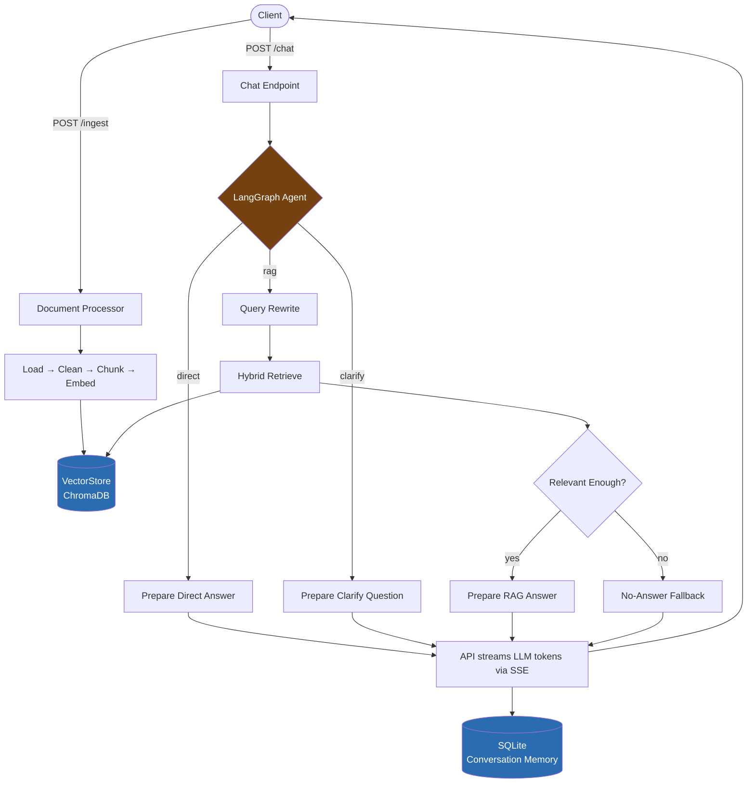
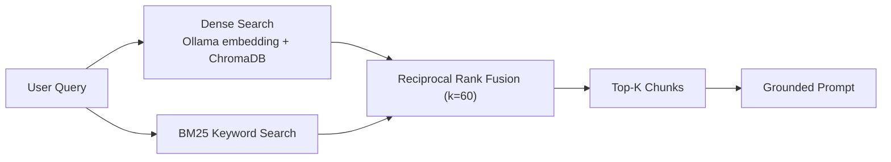
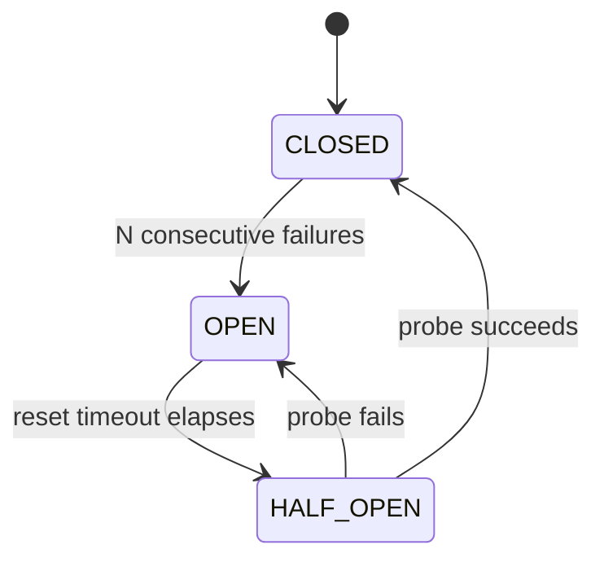

# Agentic RAG API

A **Retrieval-Augmented Generation** service that streams answers token-by-token from a stateful **LangGraph** agent, using hybrid document retrieval and a **fully local inference stack**. The LLM and the embedding model both run through [Ollama](https://ollama.com) — no cloud API keys, no external inference calls, no data leaving your machine.

---

## Why This Exists

Most "RAG in a weekend" projects hard-code one pipeline: embed the question, search, stuff the prompt, answer. That breaks down fast:

- A greeting or a follow-up shouldn't trigger a vector search.
- A vague question ("what about the second one?") embedded as-is returns garbage.
- Semantic search alone misses exact terms — product codes, names, jargon.
- A slow or unavailable vector store shouldn't take the whole API down.
- Users expect to watch an answer being written, not stare at a spinner.

This project treats each of those as a real design problem: an **agentic router** decides *how* to answer before committing to retrieval, retrieval **fuses dense and keyword search**, failures are **contained by a circuit breaker**, and answers are **streamed live** over SSE. The result behaves closer to a production system than a notebook demo, while staying small enough to read end-to-end in one sitting.

---

## What It Does

1. Upload documents (PDF, DOCX, TXT, MD) via `POST /ingest` — they're cleaned, chunked, embedded locally, and stored in ChromaDB.
2. Ask a question via `POST /chat`. A LangGraph agent decides how to handle it:
   - **Conversational** → answered directly, no retrieval.
   - **Ambiguous** → the agent asks a clarifying question instead of guessing.
   - **Needs knowledge** → the query is rewritten, relevant chunks are pulled via hybrid search, and relevance is checked before an answer is generated.
3. The answer streams back as Server-Sent Events, token by token, with source citations at the end.
4. Conversation turns persist in SQLite so follow-ups have context.

---

## Architecture



Nodes only *prepare* prompts — the API layer does the actual LLM streaming. This keeps the graph fast, deterministic, and unit-testable without mocking a token stream. ChromaDB runs embedded (no extra network hop), and the LLM client, embedder, and compiled graph are all cached singletons built once at startup.

---

## Design Patterns

| Pattern | Where | Why it's there |
|---|---|---|
| **Facade + Adapter** | `vectorstore/` | Callers depend on `VectorStore`, never on ChromaDB directly — swapping vector backends means writing one adapter, not touching call sites. |
| **Factory + Singleton** | `llm/llm_factory.py`, `embedding/embedding_factory.py`, `agent/graph.py` | `@lru_cache` guarantees the model clients and the compiled graph are built once per process, not once per request. |
| **State machine** | `agent/graph.py` | Routing (`direct` / `clarify` / `rag`) and retrieval are explicit graph edges instead of nested `if/else`, so each step is independently testable. |
| **Decorator + Registry** | `core/circuit_breaker.py` | `@circuit_breaker("vectorstore")` wraps any async call; a small registry tracks breaker state per named service. |
| **Producer–Consumer** | `api/v1/chat.py` | Token generation and SSE delivery run as separate tasks joined by an `asyncio.Queue`, so a slow client can't block generation, and disconnects cancel work cleanly. |
| **12-factor config** | `core/config.py` | All tunables come from environment variables via `pydantic-settings` — no code changes between dev/staging/prod. |

---

## How Retrieval Works



Dense search (local embeddings + ChromaDB cosine similarity) and BM25 keyword search each rank the candidate chunks; **Reciprocal Rank Fusion** merges the two ranked lists by position rather than raw score, so it stays robust even when the two methods' scores aren't comparable. This catches both semantic matches and exact-term matches that embeddings alone tend to miss.

---

## Resilience



The vector store is wrapped in an async **circuit breaker**: after repeated failures it stops calling a struggling ChromaDB and fails fast instead of piling up requests behind it, then probes periodically to recover — so one unhealthy dependency can't stall the whole event loop.

---

## Tech Stack

| Layer | Technology |
|---|---|
| API framework | FastAPI + Uvicorn |
| Agent orchestration | LangGraph |
| LLM & embeddings | Ollama (local, no cloud) — `llama3` + `nomic-embed-text` |
| Vector store | ChromaDB (embedded) |
| Sparse search | rank-bm25 |
| Streaming | sse-starlette (SSE) |
| Config | pydantic-settings |
| Observability | structlog (JSON), Prometheus, OpenTelemetry (optional) |
| Resilience | Custom async circuit breaker |
| Memory | SQLite |
| Containerization | Docker + Docker Compose |

**Python:** 3.11+

---

## Quick Start

### Docker Compose (recommended)

```bash
git clone <repo-url> && cd agentic_rag
cp .env.example .env

docker compose up -d --build
docker exec rag-ollama ollama pull llama3
docker exec rag-ollama ollama pull nomic-embed-text

curl http://localhost:8000/health
```

### Run locally

```bash
poetry install
ollama serve &
ollama pull llama3 && ollama pull nomic-embed-text

cp .env.example .env   # set OLLAMA_BASE_URL=http://localhost:11434

poetry run uvicorn app.main:app --host 0.0.0.0 --port 8000 --reload
```

### Streamlit UI (manual testing)

```bash
poetry run streamlit run frontend_streamlit.py
```

All settings are configured via environment variables — see `.env.example` for the full list (models, `TOP_K`, chunk size, circuit breaker thresholds, rate limits, etc.).

---

## API Reference

| Endpoint | Description |
|---|---|
| `POST /ingest` | Upload a PDF/DOCX/TXT/MD file → chunked, embedded, stored. Returns `doc_ids` and `chunks_created`. |
| `POST /chat` | Ask a question (`{"question": "...", "conversation_id": "..."}`) → SSE stream of `token`, `done` (sources + latency), and `error` events. |
| `GET /health` | Liveness check. |
| `GET /ready` | Readiness check — verifies Ollama and ChromaDB are reachable. |
| `GET /metrics` | Prometheus metrics (request/LLM/retrieval latency, circuit breaker state, active SSE connections). |
| `GET /docs`, `/redoc` | Swagger / ReDoc, dev environment only. |

**Example:**

```bash
curl -N -X POST http://localhost:8000/chat \
  -H "Content-Type: application/json" \
  -d '{"question": "What is the refund policy?", "conversation_id": "session-abc123"}'
```

```
data: {"type":"token","chunk":"The refund "}
data: {"type":"token","chunk":"policy allows returns within 30 days."}
data: {"type":"done","sources":[{"doc_id":"a1b2c3d4","title":"policy.txt"}],"latency_ms":1340,"token_count":47}
```

---

## Project Structure

```
app/
├── main.py            # FastAPI factory, middleware, exception handlers
├── api/v1/             # Routes: chat, ingest, health
├── agent/              # LangGraph state machine, nodes, memory, tools
├── llm/, embedding/    # Cached Ollama clients
├── vectorstore/        # Facade + adapter over ChromaDB, hybrid reranker
├── ingest/             # Document processing pipeline (load→clean→chunk→embed→upsert)
└── core/               # Config, exceptions, circuit breaker, metrics, logging, security
tests/                  # pytest unit + integration suite
frontend_streamlit.py   # Optional manual-testing UI
```

---

## Testing

```bash
poetry run pytest tests/ -m "not integration" -v   # unit tests
poetry run pytest tests/ --cov=app --cov-report=html
poetry run pytest tests/ -m integration -v          # requires Docker stack
poetry run ruff check app/ tests/
poetry run mypy app/
```

---

## Known Limitations

| Area | Issue | Suggested Fix |
|---|---|---|
| SQLite in async | `MemoryStore` uses blocking `sqlite3` calls inside the event loop | Replace with `aiosqlite` |
| CORS | Wildcard origins — tighten before production | Set `allow_origins` to your frontend domain |
| Document deletion | No endpoint to remove ingested documents, though `VectorStore.delete()` exists | Add `DELETE /documents/{doc_id}` |
| Auth | No authentication on `/ingest` or `/chat` | Add API key or JWT middleware |
| ChromaDB backup | No backup strategy for the embedded store | Schedule periodic copies of `data/chroma_db/` |
