# 🏗️ Agentic RAG System — Production Architecture Blueprint

> **Role**: AI Architect  
> **Project**: Async RAG Agent API — FastAPI · LangGraph · Ollama · Vector DB  
> **Date**: 2026-02-26  
> **Status**: Production-Ready Design

---

## Table of Contents

1. [Executive Summary](#1-executive-summary)
2. [System Context (C4 Level 1)](#2-system-context-c4-level-1)
3. [Container Architecture (C4 Level 2)](#3-container-architecture-c4-level-2)
4. [Component Breakdown (C4 Level 3)](#4-component-breakdown-c4-level-3)
5. [LangGraph Agent State Machine](#5-langgraph-agent-state-machine)
6. [Request Lifecycle & Data Flow](#6-request-lifecycle--data-flow)
7. [Ingestion Pipeline](#7-ingestion-pipeline)
8. [API Contract](#8-api-contract)
9. [Infrastructure & Docker Topology](#9-infrastructure--docker-topology)
10. [Observability Design](#10-observability-design)
11. [Security Model](#11-security-model)
12. [Testing Strategy](#12-testing-strategy)
13. [Repository Layout (Final)](#13-repository-layout-final)
14. [Technology Decision Record](#14-technology-decision-record)
15. [Evaluation & Rubric Mapping](#15-evaluation--rubric-mapping)
16. [Suggested Development Timeline](#16-suggested-development-timeline)

---

## 1. Executive Summary

This system is a **production-grade, streaming Retrieval-Augmented Generation (RAG) API** designed for enterprise document Q&A scenarios. It combines:

- **FastAPI** for async, non-blocking HTTP with Server-Sent Events (SSE) streaming
- **LangGraph** for explicit, testable multi-step agent orchestration
- **Ollama** for local LLM inference (zero cloud dependency)
- **ChromaDB / Qdrant** for semantic vector retrieval
- **Docker Compose** for one-command reproducible deployment

The system prioritizes **grounded answers**, **observability**, **resilience**, and **developer ergonomics** — meeting all acceptance criteria plus advanced add-ons across reliability, retrieval quality, security, and operations.

---

## 2. System Context (C4 Level 1)

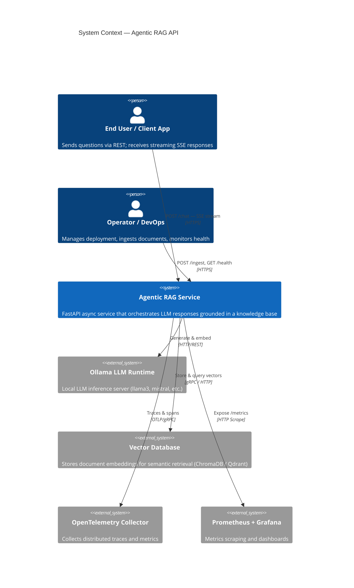

---

## 3. Container Architecture (C4 Level 2)

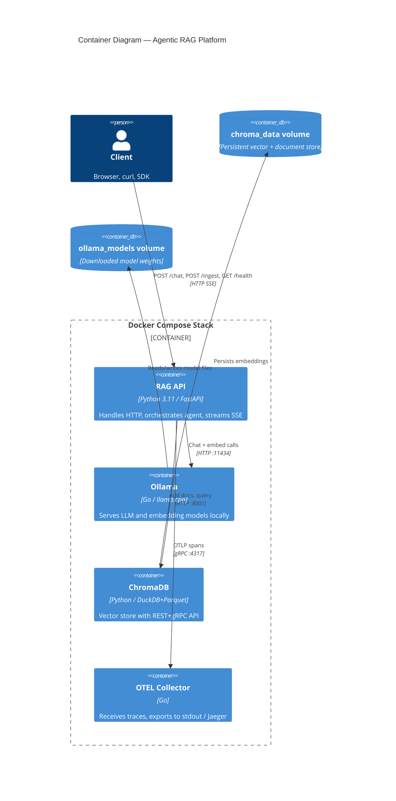

---

## 4. Component Breakdown (C4 Level 3)

### 4.1 High-Level Module Map

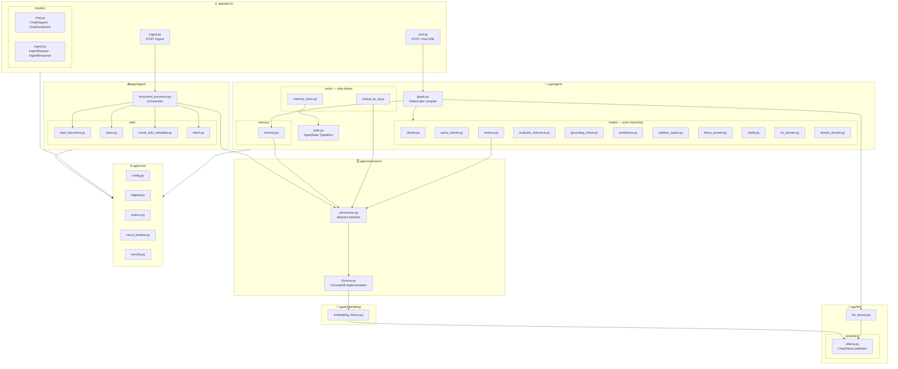


### 4.2 Internal Component Responsibilities

#### 🌐 API Layer — `app/api/v1/`

| File | Responsibility |
|------|----------------|
| `chat.py` | Validate `ChatRequest`, open SSE generator, stream graph output, handle disconnect |
| `ingest.py` | Accept JSON or multipart, delegate to `document_processor`, return `IngestResponse` |
| `models/chat.py` | `ChatRequest` · `ChatTokenEvent` · `ChatDoneEvent` · `ChatErrorEvent` · `Source` |
| `models/ingest.py` | `IngestRequest` · `IngestResponse` |

#### 🤖 Agent Layer — `app/agent/`

| File | Responsibility |
|------|----------------|
| `state.py` | `AgentState` TypedDict — single shared object passed through all nodes |
| `graph.py` | Compile `StateGraph`: register all nodes, wire conditional edges via router functions |
| `nodes/decide.py` | LLM classifier → `route`: `"rag"` / `"direct"` / `"clarify"`. Default fallback: `"rag"` |
| `nodes/query_rewrite.py` | Rewrite user question for better vector retrieval precision |
| `nodes/retrieve.py` | Dense vector search + in-process BM25 (`rank-bm25`) → RRF fusion |
| `nodes/evaluate_relevance.py` | Score docs vs query (cosine sim); set `retrieval_score`, `retrieval_sufficient`; emit metric |
| `nodes/grounding_check.py` | LLM verifier: do retrieved docs support the query? Sets `grounding_ok` |
| `nodes/synthesize.py` | Streaming LLM call with doc context + history; sets `raw_answer`, `source_ids` |
| `nodes/validate_output.py` | Pydantic output parser on `raw_answer`; sets `final_answer` or `error` |
| `nodes/direct_answer.py` | LLM answers directly without retrieval |
| `nodes/clarify.py` | LLM returns a clarification question to the user |
| `nodes/no_answer.py` | Structured "I don't know" response + ingest hint; sets `final_answer` |
| `nodes/stream_answer.py` | Terminal SSE emitter: token chunks then `done` event |
| `tools/lookup_by_id.py` | `@tool` — fetch full document by ID from vectorstore, re-rank vs query |
| `tools/memory_store.py` | `@tool` — delegate to `memory.py` to read/write conversation summaries |
| `memory/memory.py` | `store_summary(conv_id, text)` + `retrieve_context(conv_id) → str`; TTL + max-N safeguards |

#### 🧠 LLM Layer — `app/llm/`

| File | Responsibility |
|------|----------------|
| `llm_factory.py` | `LLMFactory.create(provider) → BaseChatModel`; reads `OLLAMA_MODEL` from config |
| `providers/ollama.py` | `build_ollama_llm(settings) → ChatOllama`; sets base URL, model, timeout, streaming |

#### 🔢 Embedding Layer — `app/embedding/`

| File | Responsibility |
|------|----------------|
| `embedding_factory.py` | `EmbeddingFactory.create(provider) → Embeddings`; `"ollama"` or `"sentence-transformers"` |

#### 🗄️ VectorStore Layer — `app/vectorstore/`

| File | Responsibility |
|------|----------------|
| `vectorstore.py` | `VectorStoreAdapter` abstract base: `add()`, `search()`, `get_by_id()`, `delete()` |
| `chroma.py` | `ChromaAdapter(VectorStoreAdapter)` — ChromaDB `HttpClient`; circuit breaker wrapped |

#### 📥 Ingest Layer — `app/ingest/`

| File | Responsibility |
|------|----------------|
| `document_processor.py` | Orchestrate: `load → clean → chunk → batch_upsert`; return `list[doc_id]` |
| `utils/load_document.py` | `load(source, filename) → list[Document]`; PDF, DOCX, TXT, MD, raw text |
| `utils/clean.py` | `clean(docs) → list[Document]`; strip boilerplate, normalise whitespace, drop empty pages |
| `utils/chunk_with_metadata.py` | `chunk(docs) → list[Document]`; `RecursiveCharacterTextSplitter`; `doc_id = sha256(content)` |
| `utils/batch.py` | `batch_upsert(chunks, adapter) → list[str]`; deduplicates by `doc_id` before upsert |

#### ⚙️ Core Layer — `app/core/`

| File | Responsibility |
|------|----------------|
| `config.py` | `pydantic-settings` `Settings`; all env vars; singleton via `@lru_cache` |
| `logging.py` | `structlog` JSON processor; binds `request_id`, `conv_id`, `node`, `latency_ms` |
| `metrics.py` | All `prometheus_client` counters, histograms, and gauges |
| `circuit_breaker.py` | `tenacity` retry + jitter; CLOSED → OPEN → HALF-OPEN state machine |
| `security.py` | `slowapi` rate limiter; prompt injection sanitizer; PII redactor |


---

## 5. LangGraph Agent State Machine

### 5.1 State Definition

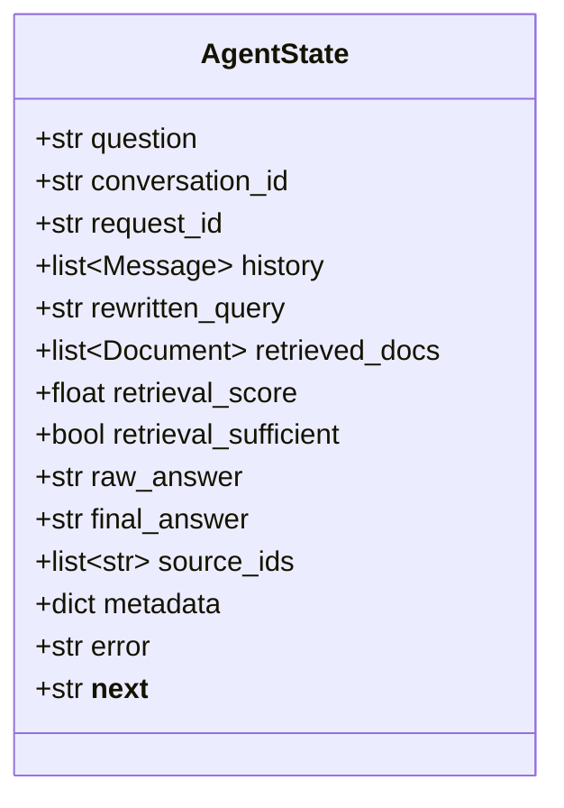

### 5.2 Full Agent Graph

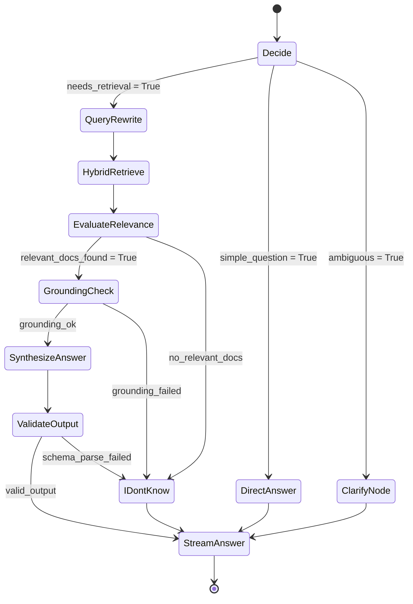

### 5.3 Node Descriptions

| Node | Input State Fields | Output State Fields | Description |
|---|---|---|---|
| `Decide` | `question`, `history` | `__next__`, `rewritten_query` | Classifier: direct / RAG / clarify |
| `QueryRewrite` | `question`, `history` | `rewritten_query` | LLM rewrites question for retrieval |
| `HybridRetrieve` | `rewritten_query`, metadata filters | `retrieved_docs` | Dense + BM25 → RRF fusion |
| `EvaluateRelevance` | `retrieved_docs`, `rewritten_query` | `retrieval_sufficient`, `retrieval_score` | Scores relevance; routes accordingly |
| `GroundingCheck` | `retrieved_docs` | `grounding_ok` | Verifies answer claims vs. docs |
| `SynthesizeAnswer` | `retrieved_docs`, `rewritten_query`, `history` | `raw_answer`, `source_ids` | LLM streams final answer |
| `ValidateOutput` | `raw_answer` | `final_answer` or `error` | Pydantic schema parse; rejects hallucinations |
| `DirectAnswer` | `question`, `history` | `final_answer` | LLM answers directly without retrieval |
| `ClarifyNode` | `question` | `final_answer` | Returns clarification question to user |
| `IDontKnow` | `question` | `final_answer` | Structured 'I don't know' with ingestion hint |
| `StreamAnswer` | `final_answer`, `source_ids`, `metadata` | — | SSE stream emitter (terminal node) |

---

## 6. Request Lifecycle & Data Flow

### 6.1 Chat Request (Happy Path)

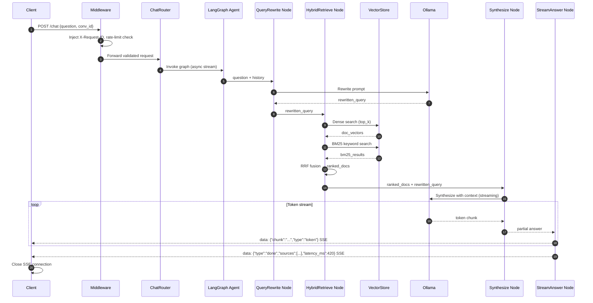

### 6.2 Client Disconnect Handling

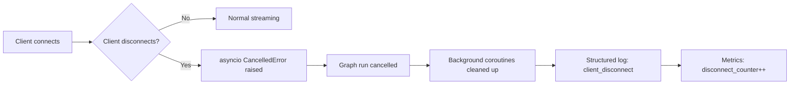

---

## 7. Ingestion Pipeline

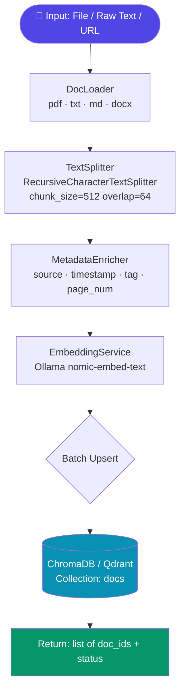

### 7.1 Chunking Strategy

| Parameter | Value | Config Key |
|---|---|---|
| Chunk size | 512 chars | `CHUNK_SIZE` |
| Overlap | 64 chars | `CHUNK_OVERLAP` |
| Splitter | `RecursiveCharacterTextSplitter` | — |
| Separators | `["\n\n", "\n", ".", " "]` | — |
| Metadata fields | `source`, `tag`, `page`, `timestamp`, `doc_id` | — |

---

## 8. API Contract

### 8.1 Endpoints Summary

| Method | Path | Auth | Description |
|---|---|---|---|
| `POST` | `/ingest` | API Key | Upload documents into the vector store |
| `POST` | `/chat` | API Key | Stream agent response (SSE) |
| `GET` | `/health` | Public | Liveness probe |
| `GET` | `/ready` | Public | Readiness: Ollama + VectorDB ping |
| `GET` | `/metrics` | Internal | Prometheus metrics scrape endpoint |
| `GET` | `/docs` | Dev only | OpenAPI / Swagger UI |

---

### 8.2 POST /ingest

**Request**
```json
{
  "text": "Optional raw text content",
  "filename": "policy.pdf",
  "content_base64": "...",
  "metadata": {
    "tag": "policy",
    "author": "hr-team"
  }
}
```

**Response** `200 OK`
```json
{
  "doc_ids": ["a1b2c3", "d4e5f6"],
  "chunks_created": 12,
  "status": "ok"
}
```

---

### 8.3 POST /chat (SSE Stream)

**Request**
```json
{
  "question": "What are the refund policies?",
  "conversation_id": "conv-uuid-1234",
  "metadata": { "tag": "policy" }
}
```

**SSE Event Stream**
```
data: {"type": "token", "chunk": "The refund policy states"}

data: {"type": "token", "chunk": " that items must be returned within 30 days."}

data: {"type": "done", "sources": [{"doc_id": "a1b2c3", "title": "policy.pdf", "page": 4}], "latency_ms": 843, "token_count": 56, "retrieval_score": 0.91}
```

**Error Event**
```
data: {"type": "error", "code": "RETRIEVAL_EMPTY", "message": "No relevant documents found. Please ingest documents on this topic."}

data: {"type": "error", "code": "OLLAMA_TIMEOUT", "message": "LLM service timed out. Try again."}
```

---

### 8.4 Pydantic Schema Diagram

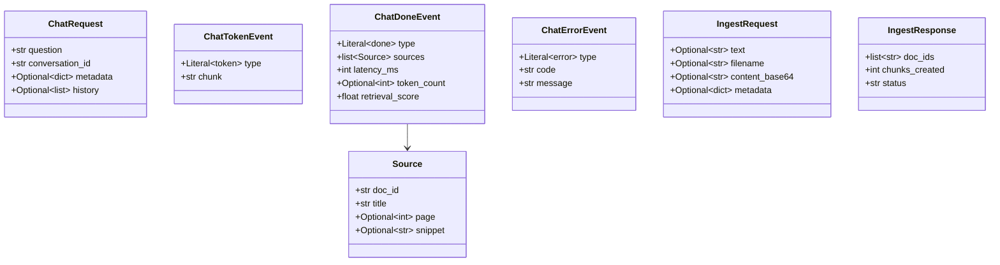

---

## 9. Infrastructure & Docker Topology

### 9.1 Docker Compose Network

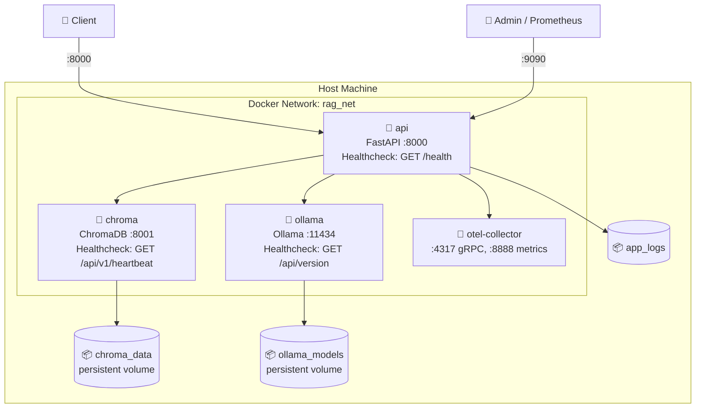

### 9.2 Dockerfile — Multi-Stage Build

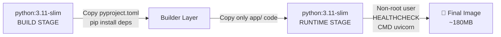

### 9.3 Health Check Chain

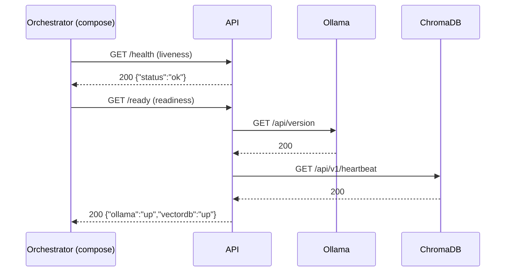

---

## 10. Observability Design

### 10.1 Three Pillars

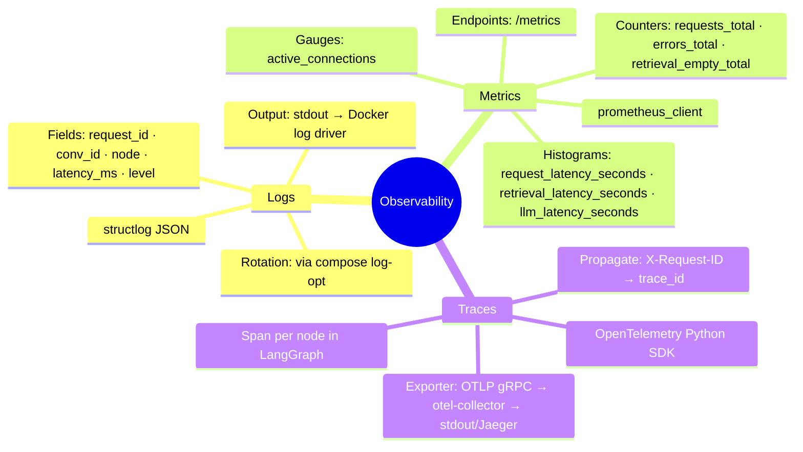

### 10.2 Example Structured Log Entry

```json
{
  "timestamp": "2026-02-26T15:30:00.123Z",
  "level": "info",
  "request_id": "req-abc-123",
  "conv_id": "conv-uuid-1234",
  "node": "hybrid_retrieve",
  "latency_ms": 145,
  "docs_retrieved": 4,
  "retrieval_score": 0.87,
  "event": "retrieval_complete"
}
```

### 10.3 Metrics Reference

| Metric Name | Type | Labels | Description |
|---|---|---|---|
| `rag_requests_total` | Counter | `endpoint`, `status` | Total API requests |
| `rag_request_latency_seconds` | Histogram | `endpoint` | End-to-end latency |
| `rag_llm_latency_seconds` | Histogram | `model` | Ollama call latency |
| `rag_retrieval_latency_seconds` | Histogram | — | Vector DB query time |
| `rag_retrieval_empty_total` | Counter | — | Times retrieval returned nothing |
| `rag_active_connections` | Gauge | — | Open SSE connections |
| `rag_circuit_breaker_state` | Gauge | `service` | 0=closed 1=open 2=half-open |

---

## 11. Security Model

### 11.1 Security Layers

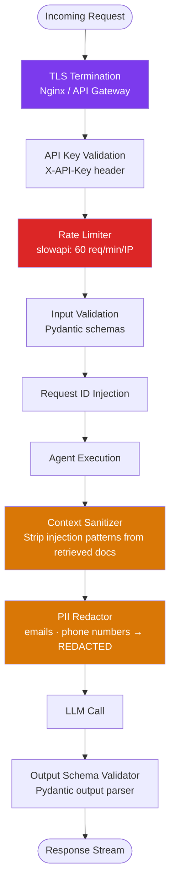

### 11.2 Threat Model

| Threat | Mitigation | Layer |
|---|---|---|
| Prompt injection via docs | Sanitize context; treat retrieved text as untrusted | `security.py` |
| API abuse / DDoS | Rate limiting per IP + API key | Middleware |
| Secret leakage | `.env` in `.gitignore`; pre-commit hook blocks `*.env` | DevOps |
| Insecure deserialization | Pydantic strict validation; no `eval` / `exec` | Schemas |
| PII exposure in logs | PII redactor node before LLM call | `nodes.py` |
| Dependency vulnerabilities | `pip-audit` in CI; Dependabot alerts | CI/CD |
| Unbound resource use | Timeouts: `OLLAMA_TIMEOUT_S`, `RETRIEVAL_TIMEOUT_S` | `circuit_breaker.py` |

---

## 12. Testing Strategy

### 12.1 Test Pyramid

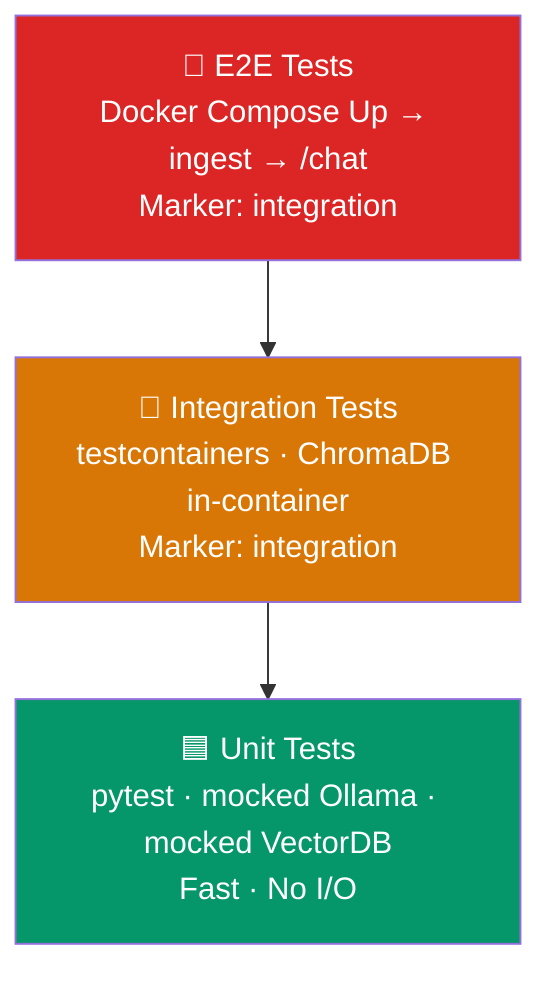

### 12.2 Test Matrix

| Test Case | Module | Strategy |
|---|---|---|
| Empty retrieval → `IDontKnow` path | `test_graph.py` | Mock VS returns `[]`; assert node = IDontKnow |
| Retrieval N docs → citations in metadata | `test_graph.py` | Mock VS returns docs; assert `source_ids` populated |
| Ollama timeout → 504 / streamed error | `test_routes_chat.py` | Mock Ollama raises `asyncio.TimeoutError` |
| Streaming: first chunk < 500ms | `test_routes_chat.py` | `time.monotonic()` before/after first SSE event |
| Ingest: chunks created correctly | `test_retrieval.py` | Assert chunk count = `ceil(len/chunk_size)` |
| Rate limit exceeded → 429 | `test_routes_chat.py` | Send 61 requests in 1 min |
| Schema validation reject bad input | `test_schemas.py` | Pydantic raises `ValidationError` |
| Circuit breaker opens after N failures | `test_circuit_breaker.py` | Simulate N Ollama failures; assert `CircuitOpen` |
| Client disconnect cancels agent | `test_routes_chat.py` | Close connection mid-stream; assert no leaked tasks |
| PII redaction removes emails | `test_security.py` | Pass text with email; assert output is `REDACTED` |

### 12.3 Running Tests

```bash
# Unit tests only (no Ollama, no DB needed)
pytest tests/ -m "not integration" -v

# Integration tests (requires Docker)
docker compose -f docker-compose.test.yml up -d
pytest tests/ -m integration -v

# Coverage report
pytest tests/ -m "not integration" --cov=app --cov-report=html
```

---

## 13. Repository Layout (Final)

```
agentic_rag/
│
├── app/
│   ├── main.py                              # FastAPI app factory + lifespan + middleware registration
│   │
│   ├── api/
│   │   └── v1/
│   │       ├── chat.py                      # POST /chat  — SSE streaming endpoint
│   │       ├── ingest.py                    # POST /ingest — document ingestion endpoint
│   │       └── models/
│   │           ├── chat.py                  # ChatRequest · ChatTokenEvent · ChatDoneEvent · ChatErrorEvent · Source
│   │           └── ingest.py                # IngestRequest · IngestResponse
│   │
│   ├── agent/
│   │   ├── state.py                         # AgentState TypedDict (single source of truth)
│   │   ├── graph.py                         # StateGraph compiler — nodes + conditional edges
│   │   │
│   │   ├── nodes/                           # PURE reasoning nodes (no I/O side-effects)
│   │   │   ├── decide.py                    # Classify intent → route: rag / direct / clarify
│   │   │   ├── query_rewrite.py             # Rewrite question for retrieval
│   │   │   ├── retrieve.py                  # Dense + BM25 (in-process) → RRF fusion
│   │   │   ├── evaluate_relevance.py        # Score relevance → retrieval_sufficient flag + metric
│   │   │   ├── grounding_check.py           # Verify claims vs retrieved docs
│   │   │   ├── synthesize.py                # Streaming LLM synthesis with context
│   │   │   ├── validate_output.py           # Pydantic output parse → final_answer or error
│   │   │   ├── direct_answer.py             # LLM answer with no retrieval
│   │   │   ├── clarify.py                   # Generate clarification question
│   │   │   ├── no_answer.py                 # Structured 'I don't know' + ingest hint
│   │   │   └── stream_answer.py             # Terminal SSE emitter node
│   │   │
│   │   ├── tools/                           # SIDE-EFFECT tools (called via LangGraph ToolNode)
│   │   │   ├── lookup_by_id.py              # Fetch full doc by ID + cross-encoder re-rank
│   │   │   └── memory_store.py              # Read / write conversation summaries
│   │   │
│   │   └── memory/
│   │       └── memory.py                    # store_summary() + retrieve_context(); TTL + max-N safeguards
│   │
│   ├── llm/
│   │   ├── llm_factory.py                   # LLMFactory.create(provider) → BaseChatModel
│   │   └── providers/
│   │       └── ollama.py                    # build_ollama_llm(settings) → ChatOllama
│   │
│   ├── embedding/
│   │   └── embedding_factory.py             # EmbeddingFactory.create(provider) → Embeddings
│   │
│   ├── vectorstore/
│   │   ├── vectorstore.py                   # VectorStoreAdapter abstract interface
│   │   └── chroma.py                        # ChromaAdapter — concrete ChromaDB implementation
│   │
│   ├── ingest/
│   │   ├── document_processor.py            # Orchestrates: load → clean → chunk → batch_upsert
│   │   └── utils/
│   │       ├── load_document.py             # load(source, filename) → list[Document]
│   │       ├── clean.py                     # clean(docs) → list[Document]
│   │       ├── chunk_with_metadata.py       # chunk(docs, size, overlap) → list[Document] + sha256 IDs
│   │       └── batch.py                     # batch_upsert(chunks, adapter) → list[doc_id]
│   │
│   └── core/
│       ├── config.py                        # pydantic-settings Settings; all env vars; @lru_cache singleton
│       ├── logging.py                       # structlog JSON processor
│       ├── metrics.py                       # prometheus_client instruments
│       ├── circuit_breaker.py               # tenacity retry + CLOSED/OPEN/HALF-OPEN state machine
│       └── security.py                      # Rate limiter · prompt sanitizer · PII redactor
│
├── tests/
│   ├── conftest.py                          # Fixtures: mock LLM, mock VectorStoreAdapter
│   ├── agent/
│   │   ├── test_graph.py                    # Graph transition tests (all conditional edges)
│   │   ├── test_nodes.py                    # Unit test each node in isolation
│   │   └── test_tools.py                    # lookup_by_id, memory_store tests
│   ├── api/
│   │   ├── test_chat.py                     # SSE stream, disconnect, rate-limit tests
│   │   └── test_ingest.py                   # Ingest endpoint validation tests
│   ├── ingest/
│   │   └── test_document_processor.py       # load → clean → chunk → batch pipeline tests
│   ├── vectorstore/
│   │   └── test_chroma_adapter.py           # ChromaAdapter unit tests (mocked client)
│   ├── test_circuit_breaker.py              # Circuit breaker state machine tests
│   └── test_security.py                     # Rate limit, sanitizer, PII redaction tests
│
├── Dockerfile                               # Multi-stage: builder + slim runtime, non-root user
├── docker-compose.yml                       # api · ollama · chroma · otel-collector + volumes
├── docker-compose.test.yml                  # Test compose (in-memory ChromaDB, mock Ollama)
├── .env.example                             # All env vars documented, no secrets
├── pyproject.toml                           # Project metadata, deps, mypy, ruff, pytest config
├── Makefile                                 # lint · test · format · compose-up · coverage
├── .pre-commit-config.yaml                  # ruff, black, isort, detect-secrets hooks
├── .github/
│   └── workflows/
│       └── ci.yml                           # GitHub Actions: lint + unit tests + Docker build
└── README.md                                # Setup, curl examples, known limitations
```


---

## 14. Technology Decision Record

### TDR-001: Vector Database — ChromaDB

| Factor | ChromaDB | Qdrant | pgvector |
|---|---|---|---|
| Setup complexity | ✅ Minimal | 🟡 Medium | 🔴 High |
| Hybrid retrieval | 🟡 Via plugin | ✅ Built-in | 🟡 Custom |
| Persistence | ✅ DuckDB+Parquet | ✅ WAL | ✅ PostgreSQL |
| Production scale | 🟡 Medium | ✅ High | ✅ High |
| **Decision** | **Default** | **Swap-in** | — |

> **Decision**: ChromaDB as default (easy local dev), Qdrant as production swap via the `VectorStoreAdapter` abstraction.

---

### TDR-002: Streaming — SSE over WebSocket

| Factor | SSE | WebSocket |
|---|---|---|
| Simplicity | ✅ HTTP/1.1 native | 🔴 Protocol upgrade |
| Reconnection | ✅ Auto (browser) | 🔴 Manual |
| Unidirectional | ✅ Perfect fit (server → client) | 🟡 Overkill |
| Proxy support | ✅ Standard | 🟡 Needs config |
| **Decision** | **✅ SSE** | — |

---

### TDR-003: LLM Runtime — Ollama

| Factor | Value |
|---|---|
| Zero cloud cost | ✅ 100% local inference |
| Model variety | llama3, mistral, qwen2.5, phi-3 |
| Embedding support | nomic-embed-text, mxbai-embed |
| Docker image | `ollama/ollama` official |
| API compatibility | OpenAI-compatible REST |

---

### TDR-004: Agent Orchestration — LangGraph

| Factor | LangGraph | Plain LangChain | Custom FSM |
|---|---|---|---|
| Explicit state | ✅ TypedDict | 🔴 Implicit | 🟡 Manual |
| Conditional routing | ✅ First-class | 🟡 Chains | ✅ Manual |
| Testability | ✅ Node-by-node | 🟡 End-to-end | ✅ |
| Streaming support | ✅ Native | 🟡 Partial | 🔴 Manual |
| **Decision** | **✅ LangGraph** | — | — |

---

## 15. Evaluation & Rubric Mapping

| Category | Weight | How This Design Addresses It |
|---|---|---|
| **Architecture** | 25% | Clear C4 layers (API → Agent → RAG → Core); adapter pattern for VectorDB; single-responsibility nodes; no coupling between layers |
| **Correctness** | 25% | Grounding check node; IDontKnow path for empty retrieval; Pydantic output parser; circuit breaker; timeout handling |
| **Tests** | 20% | Comprehensive unit tests; mock Ollama + VectorDB fixtures; 10+ targeted test cases; edge cases covered |
| **Ops / Docker** | 15% | One-command `docker compose up`; health + readiness probes; volume persistence; multi-stage Dockerfile; `.env` driven |
| **Code Quality** | 15% | mypy strict; ruff + black; structlog; pre-commit hooks; CI workflow; typed LangGraph state |

---

## 16. Suggested Development Timeline

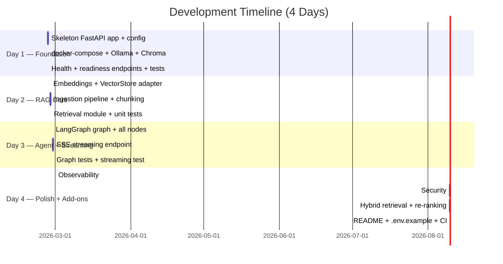

---

## 17. LangGraph Agent — Full Graph Logic

This section provides a complete visual specification of the LangGraph agent: every node, every edge (including conditional edges), data flowing through state, and the terminal SSE streaming path.

---

### 17.1 Complete Node & Edge Map

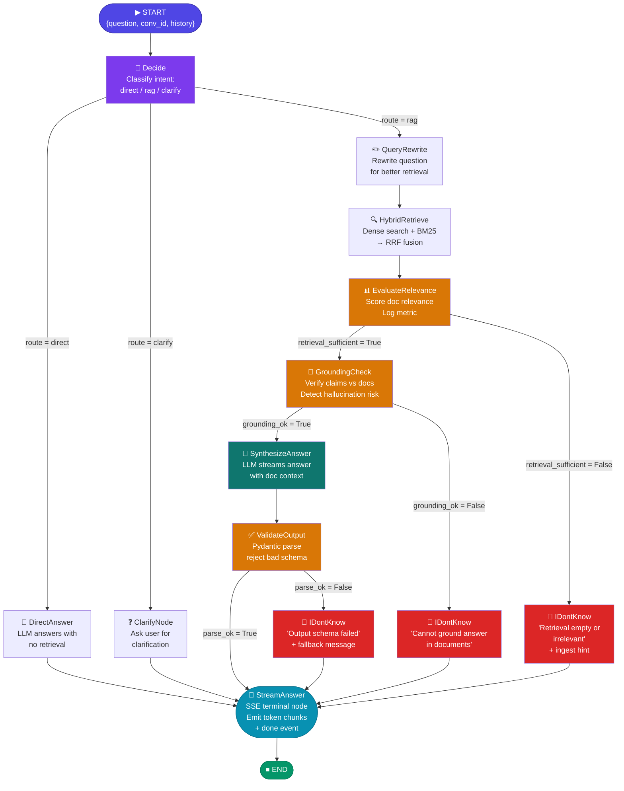

---

### 17.2 AgentState Data Flow Through Each Node

This diagram shows **which fields each node reads and writes** in the shared `AgentState`.

```mermaid
flowchart LR
    subgraph STATE ["📦 AgentState (TypedDict)"]
        direction TB
        Q[question]
        CID[conversation_id]
        RID[request_id]
        HIST[history]
        RQ[rewritten_query]
        RDOCS[retrieved_docs]
        RSCORE[retrieval_score]
        RSUFF[retrieval_sufficient]
        GROUND_OK[grounding_ok]
        RAWANS[raw_answer]
        FANS[final_answer]
        SIDS[source_ids]
        META[metadata]
        ROUTE[route]
        ERR[error]
    end

    subgraph NODES ["🤖 Graph Nodes"]
        N1["Decide\n─────────────\nREADS: question, history\nWRITES: route"]
        N2["QueryRewrite\n─────────────\nREADS: question, history\nWRITES: rewritten_query"]
        N3["HybridRetrieve\n─────────────\nREADS: rewritten_query, metadata\nWRITES: retrieved_docs"]
        N4["EvaluateRelevance\n─────────────\nREADS: retrieved_docs, rewritten_query\nWRITES: retrieval_score, retrieval_sufficient"]
        N5["GroundingCheck\n─────────────\nREADS: retrieved_docs, rewritten_query\nWRITES: grounding_ok"]
        N6["SynthesizeAnswer\n─────────────\nREADS: retrieved_docs, rewritten_query, history\nWRITES: raw_answer, source_ids"]
        N7["ValidateOutput\n─────────────\nREADS: raw_answer\nWRITES: final_answer OR error"]
        N8["DirectAnswer\n─────────────\nREADS: question, history\nWRITES: final_answer"]
        N9["ClarifyNode\n─────────────\nREADS: question\nWRITES: final_answer"]
        N10["IDontKnow\n─────────────\nREADS: question\nWRITES: final_answer, error"]
        N11["StreamAnswer\n─────────────\nREADS: final_answer, source_ids, metadata\nWRITES: (streams to client)"]
    end
```

---

### 17.3 Conditional Edge Logic (Router Functions)

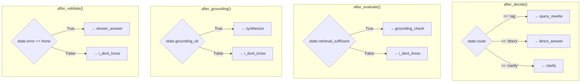

---

### 17.4 Memory Integration Loop

Conversation summaries are stored in ChromaDB and retrieved each turn to provide long-term context without growing unbounded.

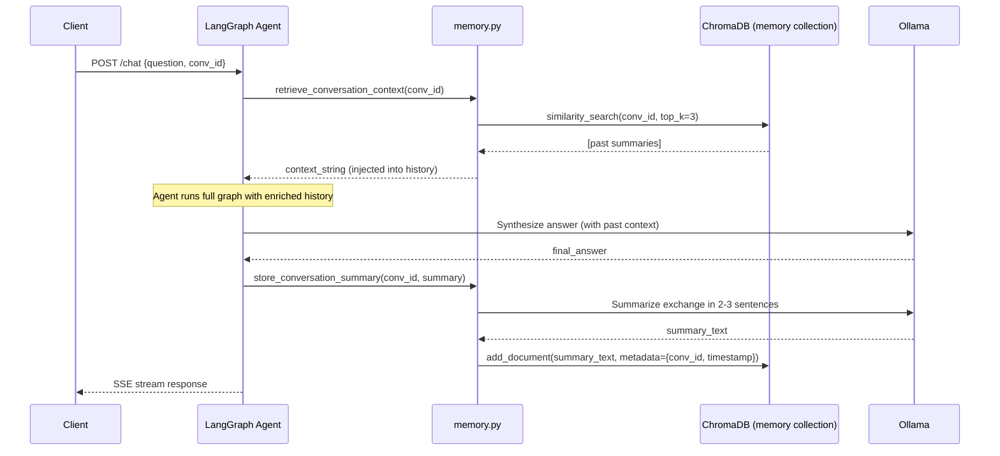

---

### 17.5 SSE Streaming Terminal Path

`StreamAnswer` is the terminal node that converts `AgentState` into an SSE event stream.

```mermaid
flowchart TD
    A["StreamAnswer node receives AgentState\nfinal_answer · source_ids · metadata · retrieval_score · latency_ms"]

    A --> B{Is answer a\nstreaming generator?}

    B -->|Yes — from SynthesizeAnswer| C["Iterate token chunks\nfrom LLM stream"]
    C --> D["Yield SSE token event\ndata: {type:'token', chunk:'...'}"]
    D -->|more chunks| C
    D -->|stream done| E

    B -->|No — static string| F["Chunk string into\nN-char pieces"]
    F --> G["Yield SSE token events"]
    G --> E

    E["Yield SSE done event\ndata: {type:'done',\nsources:[...],\nlatency_ms:...,\nretrieval_score:...}"]

    E --> H{Client disconnected?}
    H -->|Yes| I["asyncio.CancelledError\ncancel background tasks\nlog client_disconnect\nincrement disconnect_counter metric"]
    H -->|No| J["Close SSE generator\nclean up"]

    style A fill:#0891b2,color:#fff
    style E fill:#059669,color:#fff
    style I fill:#dc2626,color:#fff
```

---

### 17.6 Tool Nodes (LangChain Tools Called Inside Agent)

```mermaid
flowchart LR
    subgraph TOOL_NODE ["ToolNode (invoked by SynthesizeAnswer or Decide)"]
        T1["🔧 lookup_by_id(doc_id)\n──────────────────────\n1. Fetch full document from ChromaDB by ID\n2. Run cross-encoder re-rank against query\n3. Return top-scored Document"]

        T2["🔍 metadata_filter_search(query, filters)\n──────────────────────\n1. Apply metadata filters to collection query\n   (e.g. tag='policy', author='hr-team')\n2. Dense similarity search within filtered set\n3. Return top-K filtered Documents"]
    end

    A["SynthesizeAnswer\nor Decide node"] -->|tool_call| TOOL_NODE
    TOOL_NODE -->|Document result| A
```

---

### 17.7 Node Implementation Summary

| # | Node | File | LLM Call? | Output Fields |
|---|------|------|-----------|---------------|
| 1 | `Decide` | `nodes/decide.py` | ✅ Yes (classifier prompt) | `route` |
| 2 | `QueryRewrite` | `nodes/query_rewrite.py` | ✅ Yes | `rewritten_query` |
| 3 | `HybridRetrieve` | `nodes/retrieve.py` | ❌ No (vector ops) | `retrieved_docs` |
| 4 | `EvaluateRelevance` | `nodes/evaluate_relevance.py` | ❌ No (cosine sim) | `retrieval_score`, `retrieval_sufficient` |
| 5 | `GroundingCheck` | `nodes/grounding_check.py` | ✅ Yes (verifier prompt) | `grounding_ok` |
| 6 | `SynthesizeAnswer` | `nodes/synthesize.py` | ✅ Yes (streaming) | `raw_answer`, `source_ids` |
| 7 | `ValidateOutput` | `nodes/validate_output.py` | ❌ No (Pydantic parse) | `final_answer` or `error` |
| 8 | `DirectAnswer` | `nodes/direct_answer.py` | ✅ Yes | `final_answer` |
| 9 | `ClarifyNode` | `nodes/clarify.py` | ✅ Yes | `final_answer` |
| 10 | `IDontKnow` | `nodes/i_dont_know.py` | ❌ No (templated) | `final_answer`, `error` |
| 11 | `StreamAnswer` | `nodes/stream_answer.py` | ❌ No (SSE emit) | *(streams to client)* |

---

## Appendix A: Environment Variables Reference

| Variable | Default | Description |
|---|---|---|
| `APP_ENV` | `dev` | Environment: dev / staging / prod |
| `APP_HOST` | `0.0.0.0` | Bind address |
| `APP_PORT` | `8000` | HTTP port |
| `LOG_LEVEL` | `INFO` | Logging verbosity |
| `OLLAMA_BASE_URL` | `http://ollama:11434` | Ollama service URL |
| `OLLAMA_MODEL` | `llama3` | Chat model to use |
| `OLLAMA_EMBED_MODEL` | `nomic-embed-text` | Embedding model |
| `OLLAMA_TIMEOUT_S` | `60` | LLM call timeout (seconds) |
| `VECTOR_DB` | `chroma` | Backend: `chroma` or `qdrant` |
| `CHROMA_HOST` | `chroma` | ChromaDB hostname |
| `CHROMA_PORT` | `8001` | ChromaDB port |
| `CHROMA_COLLECTION` | `docs` | Collection name |
| `TOP_K` | `4` | Documents to retrieve |
| `MAX_CONTEXT_CHARS` | `12000` | Max chars fed to LLM |
| `RETRIEVAL_TIMEOUT_S` | `10` | Vector DB query timeout |
| `CHUNK_SIZE` | `512` | Document chunk size (chars) |
| `CHUNK_OVERLAP` | `64` | Chunk overlap (chars) |
| `API_KEY` | *(required)* | Service authentication key |
| `RATE_LIMIT` | `60/minute` | Per-IP rate limit |
| `OTEL_EXPORTER_OTLP_ENDPOINT` | `http://otel:4317` | OpenTelemetry collector |
| `ENABLE_PII_REDACTION` | `true` | Enable PII redaction |
| `CIRCUIT_BREAKER_THRESHOLD` | `5` | Failures before circuit opens |
| `CIRCUIT_BREAKER_RESET_S` | `30` | Seconds before half-open |

---

## Appendix B: Key Dependencies

```toml
# pyproject.toml (key deps)
[project]
dependencies = [
  "fastapi>=0.111",
  "uvicorn[standard]>=0.29",
  "langchain>=0.2",
  "langchain-community>=0.2",
  "langgraph>=0.1",
  "langchain-ollama>=0.1",
  "chromadb>=0.5",
  "pydantic>=2.7",
  "pydantic-settings>=2.3",
  "structlog>=24.1",
  "prometheus-client>=0.20",
  "opentelemetry-sdk>=1.24",
  "opentelemetry-exporter-otlp>=1.24",
  "tenacity>=8.3",
  "slowapi>=0.1.9",
  "python-multipart>=0.0.9",
  "httpx>=0.27",
]

[project.optional-dependencies]
dev = [
  "pytest>=8.2",
  "pytest-asyncio>=0.23",
  "pytest-cov>=5.0",
  "httpx>=0.27",
  "ruff>=0.4",
  "black>=24.4",
  "mypy>=1.10",
  "pre-commit>=3.7",
]
```

---

*Document generated by AI Architect · Agentic RAG System · 2026-02-26*
