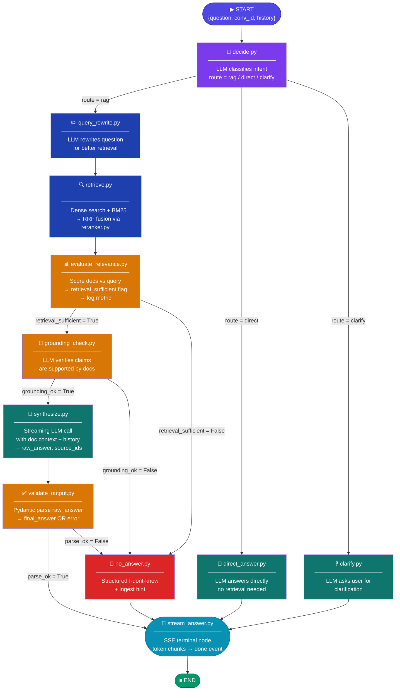
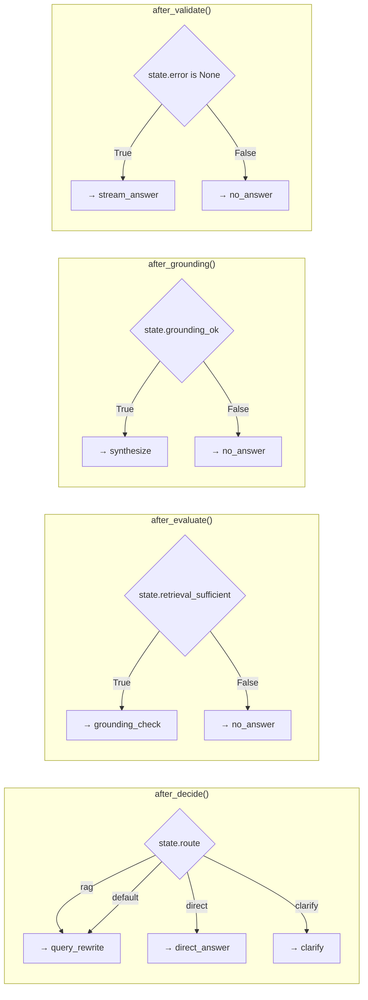
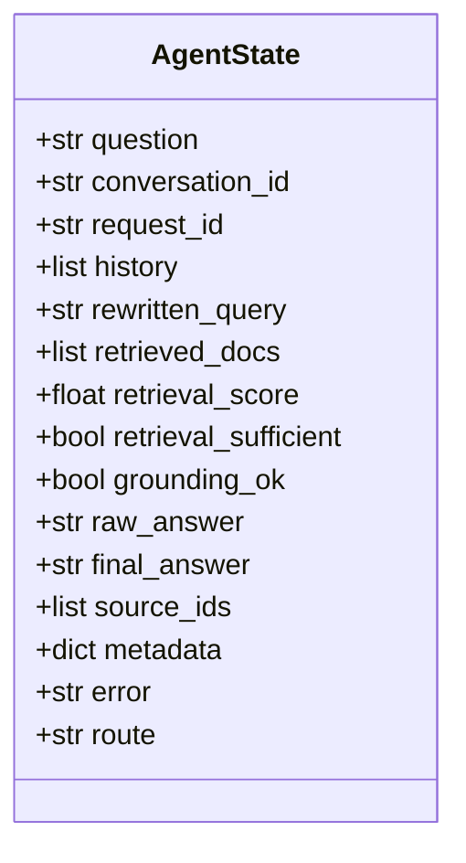

# 📁 Project Folder & File Structure

```text
agentic_rag/
│
├── app/
│   ├── __init__.py
│   ├── main.py
│   │
│   ├── api/
│   │   ├── __init__.py
│   │   └── v1/
│   │       ├── __init__.py
│   │       ├── router.py
│   │       ├── chat.py
│   │       ├── ingest.py
│   │       ├── health.py
│   │       └── models/
│   │           ├── __init__.py
│   │           ├── chat.py
│   │           └── ingest.py
│   │
│   ├── agent/
│   │   ├── __init__.py
│   │   ├── state.py
│   │   ├── graph.py
│   │   │
│   │   ├── nodes/
│   │   │   ├── __init__.py
│   │   │   ├── decide.py
│   │   │   ├── query_rewrite.py
│   │   │   ├── retrieve.py
│   │   │   ├── evaluate_relevance.py
│   │   │   ├── grounding_check.py
│   │   │   ├── synthesize.py
│   │   │   ├── validate_output.py
│   │   │   ├── direct_answer.py
│   │   │   ├── clarify.py
│   │   │   ├── no_answer.py
│   │   │   └── stream_answer.py
│   │   │
│   │   ├── tools/
│   │   │   ├── __init__.py
│   │   │   ├── lookup_by_id.py
│   │   │   └── memory_store.py
│   │   │
│   │   └── memory/
│   │       ├── __init__.py
│   │       └── conversation_memory.py
│   │
│   ├── llm/
│   │   ├── __init__.py
│   │   ├── llm_factory.py
│   │   └── providers/
│   │       ├── __init__.py
│   │       └── ollama.py
│   │
│   ├── embedding/
│   │   ├── __init__.py
│   │   ├── embedding_factory.py
│   │   └── providers/
│   │       ├── __init__.py
│   │       └── ollama.py
│   │
│   ├── vectorstore/
│   │   ├── __init__.py
│   │   ├── base.py
│   │   ├── chroma.py
│   │   └── reranker.py
│   │
│   ├── ingest/
│   │   ├── __init__.py
│   │   ├── document_processor.py
│   │   └── utils/
│   │       ├── __init__.py
│   │       ├── load_document.py
│   │       ├── clean.py
│   │       ├── chunk_with_metadata.py
│   │       └── batch.py
│   │
│   └── core/
│       ├── __init__.py
│       ├── config.py
│       ├── logging.py
│       ├── metrics.py
│       ├── circuit_breaker.py
│       ├── security.py
│       ├── exceptions.py
│       └── schemas.py
│
├── tests/
│   ├── __init__.py
│   ├── conftest.py
│   ├── agent/
│   │   ├── __init__.py
│   │   ├── conftest.py
│   │   ├── test_graph.py
│   │   ├── test_nodes.py
│   │   └── test_tools.py
│   ├── api/
│   │   ├── __init__.py
│   │   ├── conftest.py
│   │   ├── test_chat.py
│   │   └── test_ingest.py
│   ├── ingest/
│   │   ├── __init__.py
│   │   └── test_document_processor.py
│   ├── vectorstore/
│   │   ├── __init__.py
│   │   ├── conftest.py
│   │   └── test_chroma_adapter.py
│   ├── llm/
│   │   ├── __init__.py
│   │   └── test_llm_factory.py
│   ├── embedding/
│   │   ├── __init__.py
│   │   └── test_embedding_factory.py
│   ├── test_circuit_breaker.py
│   └── test_security.py
│
├── Dockerfile
├── docker-compose.yml
├── docker-compose.test.yml
├── .env.example
├── pyproject.toml
├── Makefile
├── .pre-commit-config.yaml
├── .github/
│   └── workflows/
│       └── ci.yml
└── README.md
```

---

## 🤖 Agent Graph — LangGraph State Machine



---

## 🔀 Conditional Edge Router Functions



---

## 📦 AgentState — Shared Data Contract


